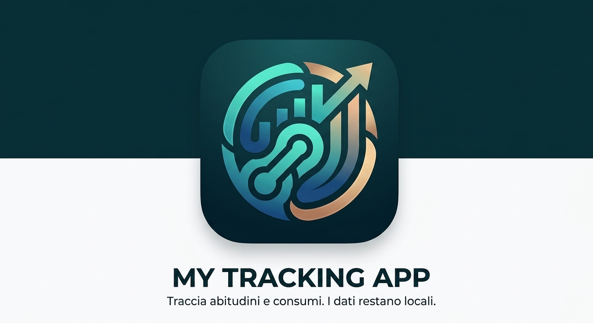

# 🚀 My Tracking App

> Applicazione Flutter per tracciare l’utilizzo quotidiano di uno o più prodotti, monitorare costi e tempo perso stimato, gestire il residuo della confezione e avere un accesso rapido da widget Android.

## ✨ Funzionalità principali

- 📦 Tracking multi-prodotto con prodotto attivo selezionabile
- 📊 Dashboard con conteggio giornaliero, residuo confezione, costo unitario e spesa totale
- 📈 Cronologia con grafici a 7 giorni e trend a 30 giorni
- 📄 Import ed export CSV
- ⚙️ Configurazione del prodotto attivo con preset e valore personalizzato per i minuti di vita persi
- 📲 Widget Home Android responsive con layout **small**, **medium** e **large**
- 🔔 Promemoria periodici globali a intervallo
- 🎨 Tema **dark / light / system**
- 🔒 Dati salvati localmente sul dispositivo

---

## 🔔 Sistema notifiche

L’app supporta promemoria periodici globali di registrazione con i seguenti intervalli:

- 30 minuti
- 1 ora
- 2 ore
- 4 ore
- 8 ore
- 12 ore

Le notifiche sono gestite su Android tramite:

- `flutter_local_notifications`
- `workmanager`

---

## 🛠️ Piattaforme

- 🤖 **Android**: piattaforma prioritaria
- 🖥️ **Windows**: supporto utile per debug e test locali

---

## 🔒 Setup locale

Prerequisiti consigliati:

- Flutter SDK compatibile con il vincolo dichiarato in `pubspec.yaml`
- Android SDK per build e test Android
- Visual Studio Code

---

## ⚡ Installazione rapida PC

Se vuoi compilare il progetto localmente:

### 1. Clona la repository
```bash
git clone https://github.com/lorenzocaputodev/my-tracking-app.git
cd my-tracking-app
```

### 2. Installa le dipendenze
```bash
flutter pub get
```

### 3. Genera le icone ufficiali
```bash
flutter pub run flutter_launcher_icons
```

### 4. Avvia l’app
```bash
flutter run
```

---

## 📂 Struttura essenziale

- `lib/models/` → modelli dati
- `lib/providers/` → stato applicativo e persistenza
- `lib/screens/` → schermate principali
- `lib/widgets/` → componenti UI riutilizzabili
- `lib/utils/` → utility, bridge e formattazione
- `android/app/src/main/kotlin/com/example/my_tracking_app/widget/` → implementazione nativa del widget Android

---

## 📌 Stato del progetto

Il progetto è attualmente funzionante, ma prima di una pubblicazione Android realmente definitiva restano da configurare questi punti:

- `applicationId` Android ancora placeholder in `android/app/build.gradle.kts`
- signing release ancora agganciato alla **debug key** in `android/app/build.gradle.kts`
- AdMob App ID ancora di **test** in `android/app/src/main/AndroidManifest.xml`

Questi valori non sono stati modificati per evitare di inserire configurazioni parziali o non definitive.

---

## 🔐 Privacy e dati

- Nessun account richiesto
- Nessun backend obbligatorio
- Dati salvati localmente sul dispositivo

---

## 👨‍💻 Sviluppo

Durante sviluppo, debugging e rifinitura del progetto è stato utilizzato supporto AI come assistenza tecnica per troubleshooting, revisione della documentazione, verifica di problemi tecnici e supporto alla scrittura e pulizia del codice.

---

## 👤 Autore

**Lorenzo Caputo**  
GitHub: [lorenzocaputodev](https://github.com/lorenzocaputodev)
