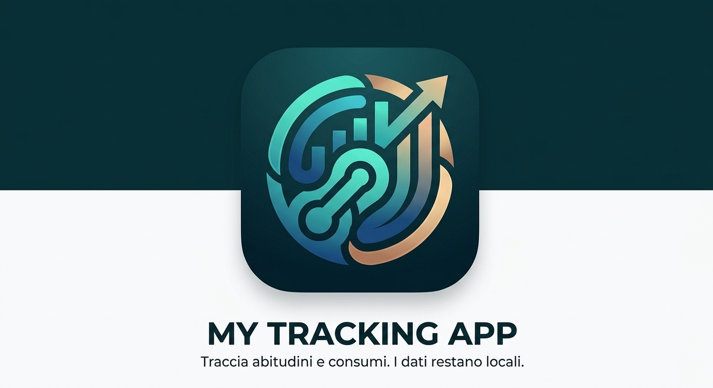
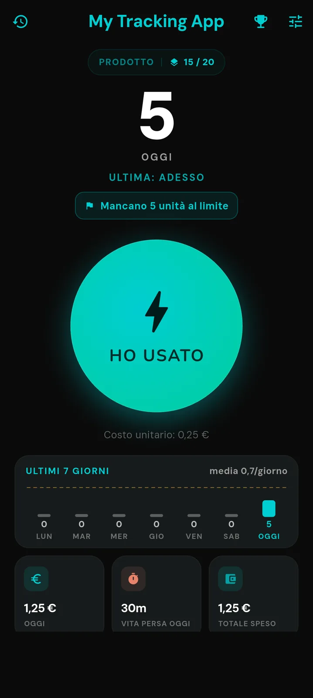
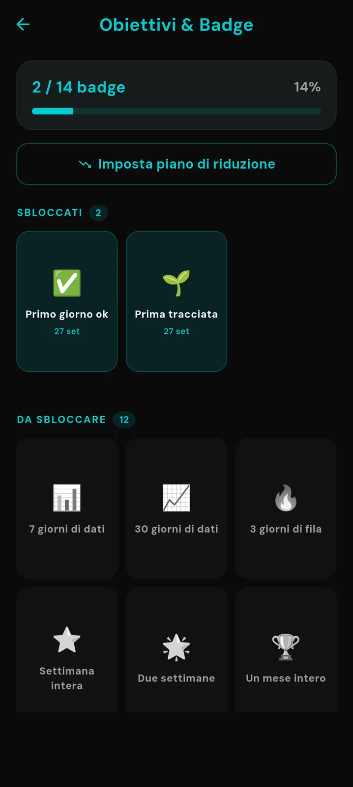
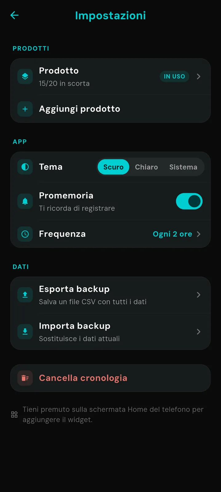
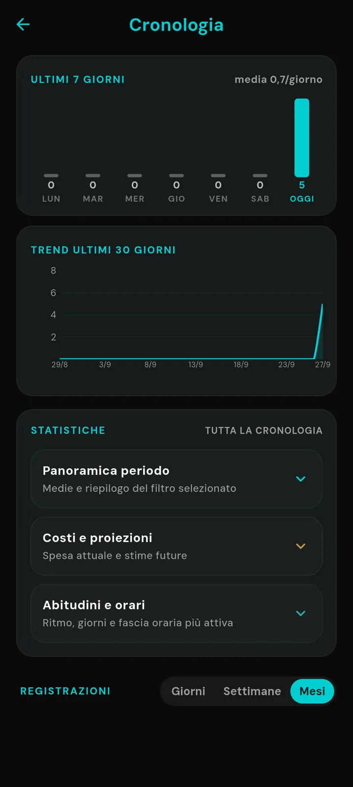

# 🚀 My Tracking App

[](https://github.com/lorenzocaputodev/my_tracking_app/actions/workflows/ci.yml) [](https://github.com/lorenzocaputodev/my_tracking_app/releases/latest) [](LICENSE) 

> **Conta le sigarette, riduci al tuo ritmo e scopri quanto risparmi.**

- 🚬 Tieni sotto controllo sigarette, IQOS e svapo, o qualsiasi abitudine vuoi ridurre
- 🔒 Senza account e senza pubblicità: i tuoi dati restano solo sul tuo telefono

## 📲 Scarica l’app

Vuoi solo installarla? Scarica l’APK dall’**[ultima versione pubblicata](https://github.com/lorenzocaputodev/my_tracking_app/releases/latest)** e aprilo dal telefono: Android ti chiederà di consentire l’installazione di app scaricate dal browser.

> **Avevi una versione precedente alla 1.4.0?** Dalla 1.4.0 l’app ha un nuovo identificativo, quindi Android la installa come app nuova. Per portare i tuoi dati: nella vecchia app vai in Impostazioni → **Esporta backup**, installa la nuova, usa **Importa backup** e poi disinstalla la vecchia.

## 📸 Schermate

<p align="center">
  
  
  
  
</p>

<p align="center"><sub>Home · Obiettivi e badge · Impostazioni · Cronologia</sub></p>

---

## ✨ Funzionalità principali

- 📦 Più prodotti da seguire, con un selettore rapido per passare dall’uno all’altro
- 📊 Home con conteggio giornaliero, scorta, costi e ultimi 7 giorni
- 📈 Cronologia raggruppata per giorni, settimane e mesi, con grafici e statistiche
- ↩️ Annulla dopo ogni registrazione e ogni cancellazione
- 🏆 Obiettivi e badge sbloccabili
- 📉 Piano di riduzione **indipendente per ogni prodotto**
- ⚙️ Impostazioni con una pagina per ogni prodotto, anche quando non è in uso
- 🗄️ Archiviazione dei prodotti con storico conservato
- 📄 Backup ed esportazione in CSV
- 📲 Widget Android per la schermata Home in tre dimensioni: **piccola**, **media** e **grande**
- 🔔 Promemoria periodici, proposti già alla prima configurazione
- 🎨 Tema **scuro / chiaro / sistema**
- 🔒 Dati salvati localmente sul dispositivo

---

## 🔔 Sistema notifiche

L’app supporta promemoria periodici globali di registrazione con i seguenti intervalli:

- 30 minuti
- 1 ora
- 2 ore
- 4 ore
- 8 ore
- 12 ore

Le notifiche sono gestite su Android tramite:

- `flutter_local_notifications`
- `workmanager`

---

## 🛠️ Piattaforme

- 🤖 **Android**: piattaforma prioritaria
- 🖥️ **Windows**: supporto utile per debug e test locali

---

## 🧰 Requisiti per compilare

Prerequisiti, con le versioni su cui la build è verificata:

- Flutter **3.47.5** stable (Dart 3.13.4)
- Android SDK con platform **android-36**, build-tools 36.0.0 e NDK 28.2.13676358
- **JDK 21** — Gradle 8.14.5 non supporta JDK 25, quindi va agganciato con
  `flutter config --jdk-dir "<percorso del JDK 21>"`
- Visual Studio Code

La catena di build usa Gradle 8.14.5, AGP 8.13.2 e Kotlin 2.2.21, volutamente
entro la linea 8.x di AGP.

Le versioni pubblicate sono firmate con una chiave personale che non è nel repository.
Senza `android/key.properties`, `flutter build apk --release` usa la chiave di debug.

`android/gradle.properties` dimensiona il daemon Gradle a 2 GB di heap: su
macchine con poca RAM valori più alti fanno terminare il daemon a metà build.

---

## ⚡ Compilare il progetto

Se vuoi compilare il progetto sul tuo PC:

### 1. Clona la repository
```bash
git clone https://github.com/lorenzocaputodev/my_tracking_app.git
cd my_tracking_app
```

### 2. Installa le dipendenze
```bash
flutter pub get
```

### 3. Genera le icone ufficiali
```bash
dart run flutter_launcher_icons
```

### 4. Avvia l’app
```bash
flutter run
```

---

## 📂 Struttura essenziale

- `lib/models/` → modelli dati
- `lib/providers/` → stato applicativo e persistenza
- `lib/screens/` → schermate principali
- `lib/widgets/` → componenti UI riutilizzabili
- `lib/theme/` → token di design, temi e decorazioni
- `lib/utils/` → utility, bridge e formattazione
- `android/app/src/main/kotlin/dev/lorenzocaputo/mytrackingapp/widget/` → implementazione nativa del widget Android

---

## 🔐 Privacy e dati

- Nessun account richiesto
- Nessun backend obbligatorio
- Dati salvati localmente sul dispositivo

---

## 👨‍💻 Sviluppo

Durante lo sviluppo, il debugging e la rifinitura del progetto è stato utilizzato supporto AI come assistenza tecnica per troubleshooting, revisione della documentazione, verifica di problemi tecnici e supporto alla scrittura e pulizia del codice.

---

## 👤 Autore

**Lorenzo Caputo**  
GitHub: [lorenzocaputodev](https://github.com/lorenzocaputodev)  
Portfolio: [lorenzocaputo.is-a.dev](https://lorenzocaputo.is-a.dev/)
